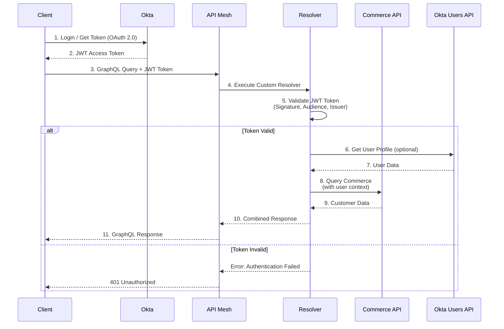

# Architecture Overview

## Authentication Flow



## Component Architecture

```
┌─────────────────────────────────────────────────────────────────┐
│                         Client Application                       │
│  (Web, Mobile, SPA - with Okta SDK integrated)                  │
└────────────────────────┬────────────────────────────────────────┘
                         │
                         │ HTTPS + Authorization: Bearer <token>
                         │
┌────────────────────────▼────────────────────────────────────────┐
│                      API Mesh Gateway                            │
│  ┌──────────────────────────────────────────────────────────┐   │
│  │           GraphQL Unified Schema                         │   │
│  │  - Type Definitions (mesh config)                        │   │
│  │  - Custom Resolvers (Okta validation)                    │   │
│  │  - Source Handlers (GraphQL, OpenAPI)                    │   │
│  └──────────────────────────────────────────────────────────┘   │
│                                                                   │
│  ┌──────────────────────────────────────────────────────────┐   │
│  │         JWT Token Validation Layer                       │   │
│  │  - JWKS signature verification                           │   │
│  │  - Audience validation                                    │   │
│  │  - Issuer validation                                      │   │
│  │  - Expiration check                                       │   │
│  └──────────────────────────────────────────────────────────┘   │
└───────────────┬──────────────────────┬──────────────────────────┘
                │                      │
                │                      │
    ┌───────────▼──────────┐  ┌────────▼────────────────┐
    │   Okta API           │  │  Adobe Commerce API     │
    │                      │  │                         │
    │  - Users API         │  │  - GraphQL Endpoint     │
    │  - User Profiles     │  │  - Customer Data        │
    │  - OAuth 2.0/OIDC    │  │  - Orders               │
    └──────────────────────┘  │  - Products             │
                              │  - Cart Operations      │
                              └─────────────────────────┘
```

## Data Flow

### 1. Token Acquisition
- User authenticates with Okta (OAuth 2.0 / OIDC flow)
- Okta validates credentials
- Returns JWT access token with claims (sub, email, scp, etc.)

### 2. Request Authentication
- Client includes token in Authorization header
- API Mesh receives request with token
- Custom resolver intercepts and validates token

### 3. Token Validation
```javascript
// Key validation steps in resolvers.js:
1. Extract token from Authorization header
2. Fetch public keys from Okta JWKS endpoint
3. Verify token signature using public key
4. Validate token claims:
   - aud: Must match configured audience
   - iss: Must match Okta issuer
   - exp: Must not be expired
5. Extract user identity from 'sub' claim
```

### 4. User Context Enrichment
- Extract user ID from token (`sub` claim)
- Optionally fetch full user profile from Okta Users API
- Store user context for use in subsequent resolvers

### 5. Authorized Data Access
- Pass authenticated user context to Commerce API
- Fetch user-specific data (orders, wishlist, addresses)
- Combine Okta user data with Commerce customer data

### 6. Response Assembly
- Merge data from multiple sources
- Return unified GraphQL response
- Include custom headers (e.g., X-Okta-User-Id)

## Security Layers

### 1. Transport Security
- **TLS/HTTPS**: All communication encrypted in transit
- **Secure Headers**: CORS, CSP, HSTS headers configured

### 2. Authentication
- **JWT Token**: Cryptographically signed by Okta
- **RS256 Algorithm**: Asymmetric encryption prevents token forgery
- **JWKS Rotation**: Public keys rotated automatically for security

### 3. Authorization
- **Audience Validation**: Ensures token is for your API
- **Scope Checking**: Validate permissions in token
- **Custom Claims**: Additional business logic validation

### 4. API Gateway Security
- **Rate Limiting**: Prevent abuse (configured in API Mesh)
- **WAF Protection**: Web Application Firewall for known attacks
- **DDoS Protection**: Distributed denial of service mitigation

## Token Claims

### Standard Claims (JWT)
```json
{
  "iss": "https://your-domain.okta.com/oauth2/default",
  "sub": "00u1a2b3c4d5e6f7g8h9",
  "aud": "api://default",
  "iat": 1516239022,
  "exp": 1516242622,
  "cid": "0oa1a2b3c4d5e6f7g8h9",
  "uid": "00u1a2b3c4d5e6f7g8h9",
  "scp": ["openid", "profile", "email"]
}
```

### User Info Claims (from ID token or /userinfo)
```json
{
  "sub": "00u1a2b3c4d5e6f7g8h9",
  "email": "user@example.com",
  "email_verified": true,
  "given_name": "John",
  "family_name": "Doe",
  "preferred_username": "john.doe@example.com"
}
```

### Custom Claims (Optional)
```json
{
  "groups": ["Customers", "Premium"],
  "department": "Sales",
  "customer_tier": "gold"
}
```

## Error Handling

### Authentication Errors
| Error | HTTP Status | Description |
|-------|-------------|-------------|
| No token provided | 401 | Missing Authorization header |
| Invalid signature | 401 | Token signature verification failed |
| Token expired | 401 | Token exp claim is in the past |
| Invalid audience | 401 | Token aud doesn't match configured audience |
| Invalid issuer | 401 | Token iss doesn't match Okta issuer |

### Authorization Errors
| Error | HTTP Status | Description |
|-------|-------------|-------------|
| Insufficient scope | 403 | Token lacks required permissions |
| Invalid role | 403 | User role not authorized for operation |

## Performance Considerations

### Caching Strategy

1. **JWKS Cache**
   - Public keys cached for 24 hours
   - Reduces latency on token validation
   - Automatic refresh on cache miss

2. **User Profile Cache** (Optional)
   ```json
   {
     "cache": {
       "http": {
         "ttl": 3600
       }
     }
   }
   ```

3. **Commerce API Cache**
   - Use API Mesh's built-in caching
   - Configure per-query TTL
   - Invalidate on mutations

### Optimization Tips

1. **Minimize Okta API Calls**
   - Use token claims when possible
   - Cache user profiles client-side
   - Implement refresh token flow

2. **Batch Requests**
   - Use GraphQL query batching
   - Combine multiple data fetches
   - Reduce round trips

3. **Edge Caching**
   - Leverage Fastly CDN (API Mesh edge)
   - Cache public data aggressively
   - Use cache-control headers

## Scalability

### Horizontal Scaling
- API Mesh runs on Adobe I/O Runtime (serverless)
- Auto-scales based on demand
- No infrastructure management required

### Global Distribution
- API Mesh deployed on edge locations
- Low latency worldwide
- Regional failover support

## Monitoring & Observability

### Logging
```javascript
// Add custom logging in resolvers
console.log('User authenticated:', {
  userId: decoded.sub,
  email: decoded.email,
  timestamp: new Date().toISOString()
});
```

### Metrics to Track
- Token validation success/failure rate
- Response times per query
- Error rates by type
- Cache hit/miss ratios
- API Mesh throughput

### Debugging
```bash
# Enable debug mode in API Mesh
aio api-mesh:update --debug

# View logs
aio api-mesh:logs --tail
```

## Best Practices

### 1. Token Management
- Use short-lived access tokens (1 hour default)
- Implement refresh token flow for long sessions
- Store tokens securely (httpOnly cookies, secure storage)

### 2. Secret Management
- Never commit secrets to source control
- Use API Mesh secrets for sensitive values
- Rotate API tokens regularly

### 3. Error Handling
- Return meaningful error messages
- Don't expose sensitive information in errors
- Log errors for debugging

### 4. Testing
- Test with invalid tokens
- Test with expired tokens
- Test edge cases (missing claims, malformed tokens)
- Load test authentication flow

### 5. Compliance
- Implement proper consent management
- Follow GDPR/CCPA requirements
- Audit authentication logs
- Document data flows

## Okta vs Auth0 Comparison

| Feature | Okta | Auth0 |
|---------|------|-------|
| **Token Format** | OAuth 2.0 / OIDC JWT | OAuth 2.0 / OIDC JWT |
| **JWKS Endpoint** | `/oauth2/default/v1/keys` | `/.well-known/jwks.json` |
| **Issuer Format** | `https://domain.okta.com/oauth2/default` | `https://domain.auth0.com/` |
| **User API** | Users API (SSWS token) | Management API (Bearer token) |
| **Default Audience** | `api://default` | Custom API identifier |
| **SDK Support** | Comprehensive | Comprehensive |

## Additional Resources

- [Okta OAuth 2.0 Guide](https://developer.okta.com/docs/guides/implement-grant-type/overview/)
- [API Mesh Security](https://developer.adobe.com/graphql-mesh-gateway/mesh/advanced/security/)
- [GraphQL Security](https://graphql.org/learn/authorization/)
- [JWT.io](https://jwt.io) - Token decoder and verifier

