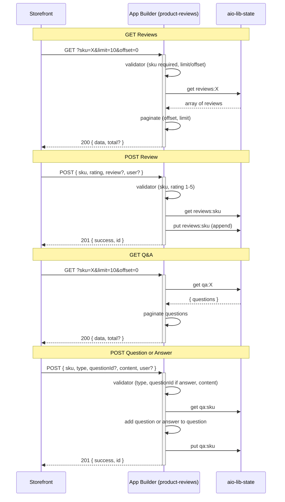

# Extension Architecture: Product Reviews and Q&A

## Document Control

| Field | Value |
|-------|-------|
| **Version** | 1.0 |
| **Status** | draft |
| **Last Updated** | 2025-03-04 |
| **Architect** | — |
| **Requirements Source** | REQUIREMENTS.md v1.0 |

---

## Environment

| Aspect | Value |
|--------|-------|
| **Platform** | saas |
| **Application Type** | headless |
| **Commerce Version** | 2.4.x (Adobe Commerce as a Cloud Service) |
| **Runtime** | Node.js 22 |

---

## Integration Points

This extension does **not** subscribe to Commerce events. It exposes **REST API endpoints** that a storefront (or storefront backend) calls to read and write product reviews and Q&A. No Commerce event subscription or EVENTS_SCHEMA.json usage is required.

### Caller: Storefront (or storefront backend)

| Aspect | Value |
|--------|-------|
| **API Type** | REST (HTTP GET/POST) |
| **Authentication** | Adobe IMS (require-adobe-auth: true) — storefront backend uses IMS to call App Builder web actions |
| **Data Flow** | Storefront → App Builder (read/write reviews and Q&A) |

---

## Component Architecture

### Runtime Actions (Web Actions)

Four web actions under a single package `product-reviews`. Each action is invoked via HTTP and performs validation, then state read/write, then returns a JSON response with an appropriate HTTP status code.

#### Action: reviews-get

- **Path**: `actions/product-reviews/reviews-get/`
- **HTTP**: GET (query params: `sku`, `limit`, `offset`)
- **Purpose**: Return paginated product reviews for a given SKU.
- **Files**: `index.js`, `validator.js`
- **Trigger**: HTTP GET from storefront.

#### Action: reviews-post

- **Path**: `actions/product-reviews/reviews-post/`
- **HTTP**: POST (JSON body: `sku`, `rating`, `review?`, `user?`)
- **Purpose**: Validate input, persist one review for the given SKU, return 201 or validation errors.
- **Files**: `index.js`, `validator.js`
- **Trigger**: HTTP POST from storefront.

#### Action: qa-get

- **Path**: `actions/product-reviews/qa-get/`
- **HTTP**: GET (query params: `sku`, `limit`, `offset`)
- **Purpose**: Return paginated questions and their answers for a given SKU.
- **Files**: `index.js`, `validator.js`
- **Trigger**: HTTP GET from storefront.

#### Action: qa-post

- **Path**: `actions/product-reviews/qa-post/`
- **HTTP**: POST (JSON body: `sku`, `type`, `questionId?`, `content`, `user?`)
- **Purpose**: Validate input, persist a question or an answer (linked to questionId), return 201 or validation errors.
- **Files**: `index.js`, `validator.js`
- **Trigger**: HTTP POST from storefront.

**Note**: These are REST web actions, not event handlers. The 6-file event-handler pattern (pre, transformer, sender, post) does not apply; each action uses `index.js` (orchestration + state I/O) and `validator.js` (input validation) only.

---

## State Management

**Storage**: `@adobe/aio-lib-state` (App Builder state only; no external database).

| Key Pattern | Purpose | TTL |
|------------|---------|-----|
| `reviews:{sku}` | Array of review objects for product `sku` | None (persist until explicitly removed) |
| `qa:{sku}` | Object `{ questions: [ { id, content, user?, createdAt, answers: [ { id, content, user?, createdAt } ] } ] }` for product `sku` | None |

**Review object shape**: `{ id, sku, rating, review?, user?, createdAt }`  
**Question object shape**: `{ id, content, user?, createdAt, answers: [ { id, content, user?, createdAt } ] }`  
**Answer object shape**: `{ id, content, user?, createdAt }`

- **IDs**: Generate unique IDs (e.g. `crypto.randomUUID()` or nanoid) for each review and each question/answer so the storefront can reference `questionId` for answers.
- **Pagination**: Applied in-memory after reading the full list for the SKU: slice the array with `offset` and `limit`. For very large lists, consider splitting by segment in a later iteration.
- **Concurrency**: State `get` then `put` is not atomic; for high contention, consider append-only structures or documented limitations.

---

## API Contract

### Reviews GET

- **Query**: `sku` (required), `limit` (optional, default 10), `offset` (optional, default 0).
- **Success (200)**: `{ "data": [ { "id", "sku", "rating", "review?", "user?", "createdAt" } ], "total"?: number }`
- **Error (400)**: `{ "error": "message" }` e.g. missing sku, invalid limit/offset.

### Reviews POST

- **Body**: `{ "sku", "rating", "review?", "user?" }`
- **Success (201)**: `{ "success": true, "id": "<reviewId>" }`
- **Error (400)**: `{ "error": "message" }` e.g. missing sku/rating, rating not 1–5.

### Q&A GET

- **Query**: `sku` (required), `limit` (optional, default 10), `offset` (optional, default 0).
- **Success (200)**: `{ "data": [ { "id", "content", "user?", "createdAt", "answers": [ { "id", "content", "user?", "createdAt" } ] } ], "total"?: number }`
- **Error (400)**: `{ "error": "message" }` e.g. missing sku.

### Q&A POST

- **Body**: `{ "sku", "type": "question"|"answer", "questionId?" (required if type=== "answer"), "content", "user?" }`
- **Success (201)**: `{ "success": true, "id": "<questionId|answerId>" }`
- **Error (400/404)**: `{ "error": "message" }` e.g. missing fields, invalid type, questionId required for answer, question not found.

---

## Configuration Impact

### Files to Create/Update

| File | Action | Details |
|------|--------|---------|
| `app.config.yaml` | Update | Add package `product-reviews` with four web actions: `reviews-get`, `reviews-post`, `qa-get`, `qa-post`. All `web: 'yes'`, `require-adobe-auth: true`, `runtime: nodejs:22`. |
| `actions/product-reviews/actions.config.yaml` | Create | Declare the four actions and their entry points. |
| `env.dist` | Update | No new env vars required for minimal implementation (state uses default namespace). Optional: `LOG_LEVEL` per action. |

### Environment Variables

| Variable | Purpose | Example |
|----------|---------|---------|
| `LOG_LEVEL` | Logging level for actions | `info` |

State is used with default init (no extra env vars required for aio-lib-state in App Builder).

---

## Security Architecture

### Authentication

- **Method**: Adobe IMS (OAuth 2.0). Web actions use `require-adobe-auth: true` so only callers with a valid IMS token (e.g. storefront backend or server-to-server) can invoke the endpoints.
- **Storefront usage**: The storefront should call these endpoints from a backend that holds IMS credentials and passes the token, or via an API gateway that performs IMS authentication.

### Input Validation

- All query and body inputs must be validated in `validator.js`: required fields, types, ranges (e.g. rating 1–5), and for Q&A POST that `questionId` is present when `type === "answer"` and that the referenced question exists for the given SKU.
- Reject invalid input with 400 and a clear `error` message.

### Secrets Management

- No application-specific secrets are required for reviews/Q&A storage (state is tenant-isolated). Use existing project patterns for `LOG_LEVEL` or other globals.

---

## Data Flow

---

## Decisions Log

| ID | Decision | Rationale | Alternatives Considered |
|----|----------|-----------|--------------------------|
| AD-1 | Use aio-lib-state for persistence | Project rules forbid external DB; state is supported and sufficient for moderate volume per SKU. | aio-lib-files (better for very large payloads); external DB (disallowed). |
| AD-2 | One state key per SKU for reviews (`reviews:{sku}`) | Simple read/write and pagination in memory. | Separate key per review (more keys, harder to list by SKU). |
| AD-3 | One state key per SKU for Q&A (`qa:{sku}`) with nested answers | Single read for full Q&A; answers clearly tied to questions. | Separate keys per question/answer (more reads, more complexity). |
| AD-4 | Web actions only; no Commerce events | Requirement is storefront-facing REST API, not event-driven sync. | Event-driven sync (does not match requirement). |
| AD-5 | Two files per action (index.js, validator.js) | Keeps validation testable and main flow clear; no need for 6-file event-handler pattern. | Single file; or full 6-file pattern (overkill for REST). |
| AD-6 | require-adobe-auth: true on all four actions | Only authenticated callers (e.g. storefront backend with IMS) can submit or read data. | Public endpoints (higher abuse risk). |

---

## Testing Strategy Recommendations

- **Unit tests**: For each action, unit-test `validator.js` with valid inputs, missing required fields, invalid types, invalid ranges (e.g. rating 0 or 6), and for qa-post: type "answer" without questionId, non-existent questionId. Mock `@adobe/aio-lib-state` in index tests.
- **Integration tests**: Invoke each web action with mocked state and assert response status and body shape (200/201 vs 400/404) and that state put keys and value shapes match this architecture.
- **Coverage**: Target ≥80% for product-reviews actions and validators.

---

## Approvals

| Role | Name | Date |
|------|------|------|
| Architect | | |
| Technical Lead | | |
