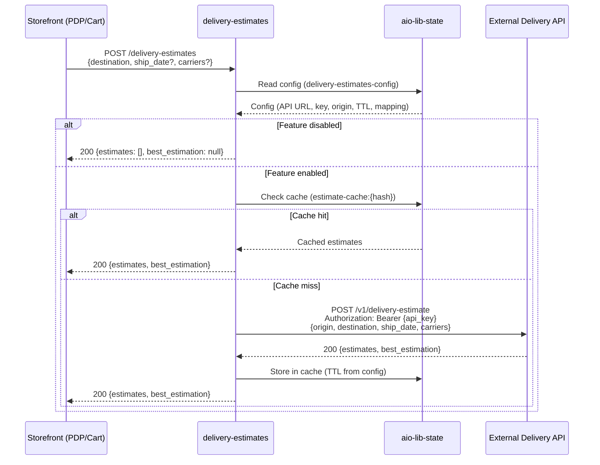
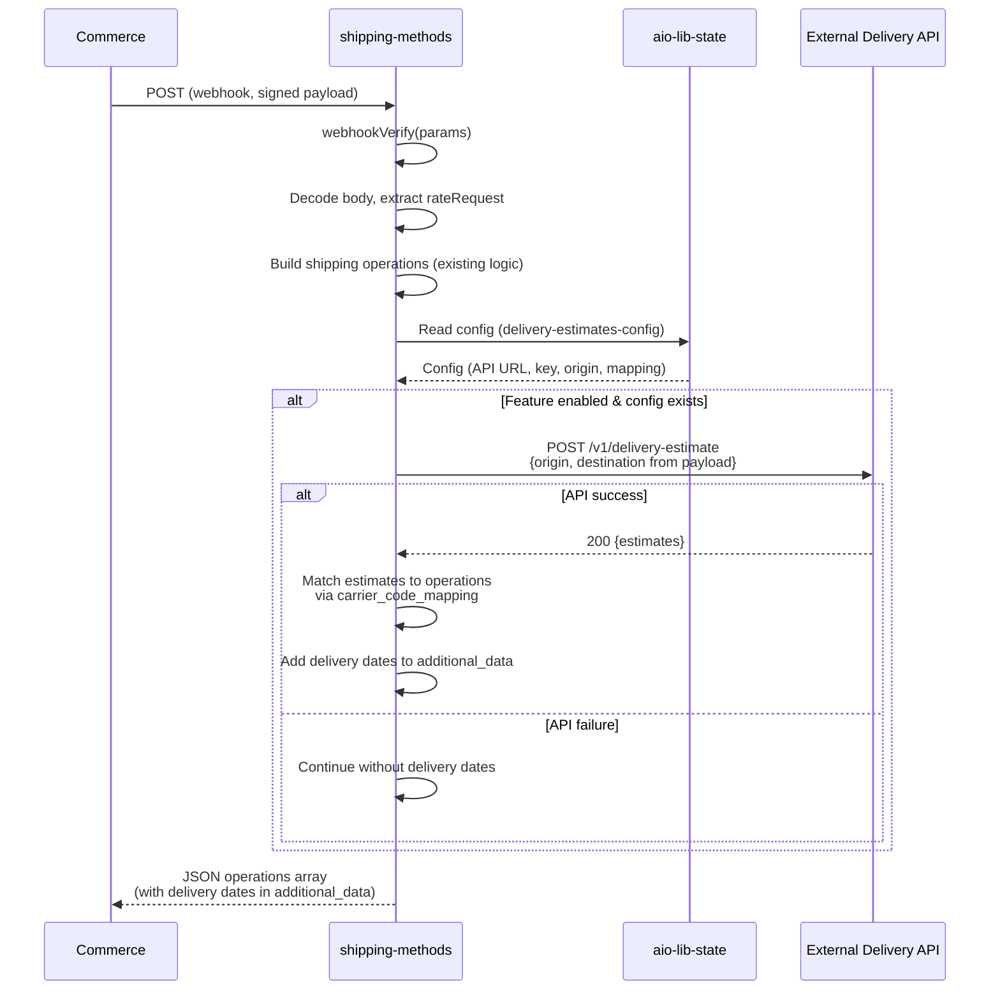
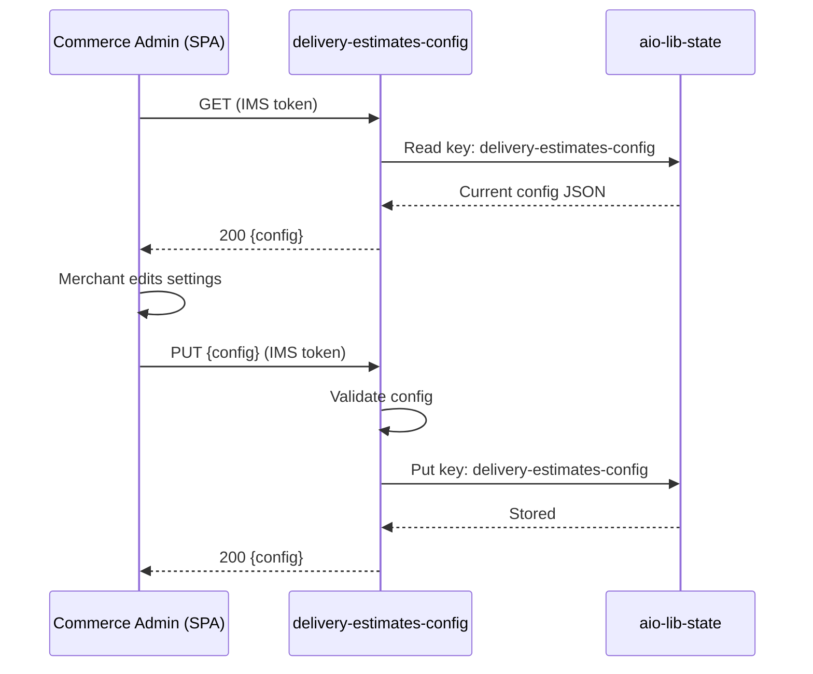

# Extension Architecture: Shipping Delivery Date Estimates

<!--
  Schema: .cursor/references/architecture.schema.json
  Webhook Validation Table: .cursor/references/webhook-validation.schema.json
  Example: .cursor/examples/ARCHITECTURE.example.md
-->

## Contents

- Document Control — Environment — Webhook Validation Table (REQUIRED) — Component Architecture — Configuration Impact — Security Architecture — Data Flow — Decisions Log

## Document Control

| Field | Value |
|-------|-------|
| **Extension Name** | Shipping Delivery Date Estimates |
| **Version** | 1.0 |
| **Status** | draft |
| **Last Updated** | 2026-03-06 |
| **Requirements Source** | REQUIREMENTS.md v1.0 |

---

## Environment

| Aspect | Value |
|--------|-------|
| **Platform** | SaaS |
| **Application Type** | Headless |
| **Runtime** | Node.js 22 |
| **Starter Kit** | Checkout Starter Kit |
| **IMS** | Mandatory (SaaS) |

---

## Webhook Validation Table (REQUIRED)

All REQUIRED fields verified with Adobe documentation before Phase 3 approval.

| Target Domain | Action File | Webhook Method Name ⭐ | Webhook Type ⭐ | Response Format | Required | Logging Headers | Documentation Source ⭐ |
|---------------|-------------|------------------------|-----------------|-----------------|----------|------------------|--------------------------|
| shipping | `actions/shipping-methods/index.js` | `plugin.magento.out_of_process_shipping_methods.api.shipping_rate_repository.get_rates` | **after** | JSON operations array | **Optional** | `x-ow-extra-logging: on` | Commerce Core: `help/cloud-service/tutorials/shipping-method-extension.md`; Commerce Extensibility: `src/pages/starter-kit/checkout/shipping-use-cases.md` |

### Webhook Configuration Summary

- **Webhook Method Name:** `plugin.magento.out_of_process_shipping_methods.api.shipping_rate_repository.get_rates` — This is the plugin method Commerce invokes when a shopping cart requests shipping rates. Registered in Commerce Admin under **Stores > Configuration > Adobe Services > Commerce Webhooks**.
- **Webhook Type:** `after` — The webhook is dispatched **after** the core shipping rate repository returns its rates, allowing the App Builder action to add or modify shipping methods. (Source: `help/cloud-service/tutorials/shipping-method-extension.md` — "Webhook type: after")
- **Required: Optional** — Set to Optional so that if the webhook returns no shipping methods (e.g., API error, unsupported region), Commerce falls back to its built-in shipping methods rather than showing an error to the customer. (Source: same tutorial — "Required: Optional - This allows checkout to still work if the external API returns no rates.")
- **Dual Security:**
  1. **OAuth** (`require-adobe-auth: false` for webhook actions) — Commerce calls the webhook directly; the action is invoked by the Runtime platform on behalf of Commerce. Note: webhook actions use `require-adobe-auth: false` with `raw-http: true` because Commerce sends signed payloads, not IMS tokens.
  2. **Signature Verification** (code) — `webhookVerify(params)` validates the `x-adobe-commerce-webhook-signature` header using `COMMERCE_WEBHOOKS_PUBLIC_KEY`. Enable signature verification in Commerce Admin under **Stores > Configuration > Adobe Services > Webhooks > Enabled: Yes > Regenerate key pair**. (Source: `src/pages/webhooks/signature-verification.md`)
- **Logging:** Enable `x-ow-extra-logging: on` in Commerce Admin webhook configuration for debugging. Runtime does not log successful invocations by default.

---

## Component Architecture

This extension has four runtime components plus an Admin UI SPA:

### Runtime Actions

| # | Action | Path | Type | Purpose | Auth |
|---|--------|------|------|---------|------|
| 1 | **delivery-estimates** | `actions/delivery-estimates/index.js` | Standalone web action (BFF) | Storefront calls for PDP/cart delivery dates | `require-adobe-auth: false` |
| 2 | **shipping-methods** | `actions/shipping-methods/index.js` | Webhook action (existing, modify) | Enriches shipping rates with delivery dates in `additional_data` | `require-adobe-auth: false` + signature verification |
| 3 | **delivery-estimates-config** | `commerce-backend-ui-1/actions/delivery-estimates-config/index.js` | Admin backend action | CRUD for delivery estimate settings in `aio-lib-state` | `require-adobe-auth: true` (IMS) |

### Shared Library Modules (NEW)

| Module | Path | Purpose | Used By |
|--------|------|---------|---------|
| **delivery-estimate-client.js** | `lib/delivery-estimate-client.js` | HTTP client for external delivery estimate API (Bearer auth, error handling) | `delivery-estimates`, `shipping-methods` |
| **delivery-config.js** | `lib/delivery-config.js` | Reads/writes delivery estimate config from/to `aio-lib-state` | `delivery-estimates`, `shipping-methods`, `delivery-estimates-config` |

### Admin UI SPA (MODIFY `commerce-backend-ui-1`)

| Component | Path | Purpose |
|-----------|------|---------|
| **ExtensionRegistration** | `commerce-backend-ui-1/web-src/src/components/ExtensionRegistration.js` | Update: register Delivery Estimates menu item alongside existing Tax menu |
| **MainPage** | `commerce-backend-ui-1/web-src/src/components/MainPage.js` | Update: add Delivery Estimates tab |
| **DeliveryEstimatesPage** | `commerce-backend-ui-1/web-src/src/components/DeliveryEstimatesPage.js` | NEW: config form for all delivery estimate settings |
| **registration/index.js** | `commerce-backend-ui-1/actions/registration/index.js` | Update: add Delivery Estimates menu item to Admin sidebar |

---

### Action 1: `delivery-estimates` (NEW — Storefront BFF)

**Purpose:** Standalone web action that the storefront calls from PDP/cart pages to fetch delivery date estimates. Wraps the external API, keeping credentials server-side.

**Pattern:** NOT a webhook. Regular web action. No `webhookVerify`, no `raw-http`, no `__ow_body` decoding. Receives JSON body directly from storefront HTTP POST.

**Flow:**
1. Receive request (destination, optional ship_date, optional carriers)
2. Read config from `aio-lib-state` via `lib/delivery-config.js`
3. If feature disabled → return `{ estimates: [], best_estimation: null }`
4. Build cache key from request params (destination + ship_date + carriers)
5. Check `aio-lib-state` cache → if hit, return cached result
6. Call external API via `lib/delivery-estimate-client.js`
7. Store response in `aio-lib-state` with configurable TTL
8. Return formatted response to storefront

**`require-adobe-auth: false`** rationale: PDP and cart are accessed by anonymous shoppers. The storefront cannot provide an IMS token for unauthenticated visitors. The action returns only delivery estimate data (no sensitive information). The external API key remains server-side.

**app.config.yaml definition:**
```yaml
delivery-estimates:
  function: actions/delivery-estimates/index.js
  web: 'yes'
  runtime: nodejs:22
  inputs:
    LOG_LEVEL: debug
  annotations:
    require-adobe-auth: false
    final: true
```

---

### Action 2: `shipping-methods` (MODIFY — Webhook Enrichment)

**Purpose:** Enhance the existing shipping-methods webhook to include delivery date estimates in `additional_data` for each shipping operation.

**Changes to existing action:**
1. After building shipping operations (existing logic), read config from `aio-lib-state`
2. If feature enabled, call external delivery estimate API with destination from webhook payload + origin from config
3. Match estimates to shipping operations using carrier code mapping from config
4. Append delivery date fields to each operation's `additional_data` array:
   ```json
   [
     { "key": "delivery_date", "value": "2025-03-14" },
     { "key": "safe_delivery_date", "value": "2025-03-15" },
     { "key": "transit_days", "value": "4" },
     { "key": "cutoff_datetime_utc", "value": "2025-03-10T17:00:00.000Z" }
   ]
   ```
5. If API call fails → return operations without delivery dates (graceful degradation)

**No config changes needed** — the existing `shipping-methods` action definition in `app.config.yaml` remains unchanged. Config comes from `aio-lib-state` at runtime.

---

### Action 3: `delivery-estimates-config` (NEW — Admin Backend)

**Purpose:** CRUD endpoint for Admin UI SPA to read and save delivery estimate configuration in `aio-lib-state`.

**Operations:**
- `GET` (no body) → Read current config from `aio-lib-state`, return JSON
- `PUT` (JSON body) → Validate and save config to `aio-lib-state`, return saved config

**ext.config.yaml addition (in `commerce-backend-ui-1`):**
```yaml
delivery-estimates-config:
  function: actions/delivery-estimates-config/index.js
  web: 'yes'
  runtime: 'nodejs:22'
  inputs:
    LOG_LEVEL: debug
  annotations:
    require-adobe-auth: true
    final: true
```

---

## Configuration Architecture

### Config Storage: `aio-lib-state`

All runtime configuration lives in `aio-lib-state` (not `.env`), enabling changes via the Admin UI without redeployment.

**Key:** `delivery-estimates-config`

**Value (JSON schema):**

```json
{
  "enabled": true,
  "api_base_url": "https://api.example.com/v1",
  "api_key": "bearer-token-value",
  "origin": {
    "country_code": "US",
    "postal_code": "90210",
    "city": "Beverly Hills"
  },
  "default_carriers": ["standard", "express"],
  "default_service_levels": ["standard", "express", "priority"],
  "cache_ttl_seconds": 3600,
  "carrier_code_mapping": {
    "DPS": "standard",
    "Fedex": "express"
  }
}
```

**TTL for config entry:** 365 days (maximum `aio-lib-state` TTL). Config is read on every action invocation; the long TTL prevents accidental expiration.

**Cache entries:** Keys follow pattern `estimate-cache:{hash}` where `{hash}` is derived from destination + ship_date + carriers. TTL is the configurable `cache_ttl_seconds` value.

### Constraints (aio-lib-state)

- Max value size: 1 MB (config is well under this)
- Max key size: 1024 bytes (cache keys well under this)
- Max TTL: 365 days
- Source: `src/pages/guides/app_builder_guides/storage/index.md` (App Builder docs)

### No New `.env` Entries

Since all delivery estimate config lives in `aio-lib-state`, no new environment variables are needed. The existing `.env` entries (`COMMERCE_WEBHOOKS_PUBLIC_KEY`, `COMMERCE_BASE_URL`, OAuth credentials) remain unchanged.

---

## Configuration Impact

### Files to Create

| File | Purpose |
|------|---------|
| `actions/delivery-estimates/index.js` | Storefront BFF action |
| `lib/delivery-estimate-client.js` | External API HTTP client |
| `lib/delivery-config.js` | `aio-lib-state` config reader/writer |
| `commerce-backend-ui-1/actions/delivery-estimates-config/index.js` | Admin config CRUD action |
| `commerce-backend-ui-1/web-src/src/components/DeliveryEstimatesPage.js` | Admin UI config page |
| `docs/ACTION_API_SPEC.md` | Storefront API contract (handoff doc) |

### Files to Modify

| File | Change |
|------|--------|
| `app.config.yaml` | Add `delivery-estimates` action definition |
| `commerce-backend-ui-1/ext.config.yaml` | Add `delivery-estimates-config` action definition |
| `actions/shipping-methods/index.js` | Add delivery estimate enrichment logic |
| `commerce-backend-ui-1/actions/registration/index.js` | Add Delivery Estimates menu item |
| `commerce-backend-ui-1/web-src/src/components/ExtensionRegistration.js` | Update extension ID |
| `commerce-backend-ui-1/web-src/src/components/MainPage.js` | Add Delivery Estimates tab |
| `commerce-backend-ui-1/web-src/src/constants/extension.js` | Update extension ID |
| `package.json` | Add `@adobe/aio-lib-state` dependency |

### Implementation Order

1. `package.json` — add `@adobe/aio-lib-state` dependency
2. `app.config.yaml` — add `delivery-estimates` action definition
3. `commerce-backend-ui-1/ext.config.yaml` — add `delivery-estimates-config` action definition
4. `lib/delivery-config.js` — config reader/writer (shared)
5. `lib/delivery-estimate-client.js` — external API client (shared)
6. `actions/delivery-estimates/index.js` — storefront BFF action
7. `actions/shipping-methods/index.js` — enrich with delivery dates
8. `commerce-backend-ui-1/actions/delivery-estimates-config/index.js` — Admin config CRUD
9. `commerce-backend-ui-1/actions/registration/index.js` — update menu registration
10. `commerce-backend-ui-1/web-src/src/components/` — Admin UI pages
11. `docs/ACTION_API_SPEC.md` — storefront API contract

---

## Security Architecture

| Component | Mechanism | Details |
|-----------|-----------|---------|
| **shipping-methods** (webhook) | Signature verification | `webhookVerify(params)` checks `x-adobe-commerce-webhook-signature` via `COMMERCE_WEBHOOKS_PUBLIC_KEY`. `require-adobe-auth: false`, `raw-http: true`. |
| **delivery-estimates** (storefront BFF) | Public web action | `require-adobe-auth: false`. Returns non-sensitive estimate data. External API key stays server-side in `aio-lib-state`. |
| **delivery-estimates-config** (Admin) | IMS OAuth | `require-adobe-auth: true`. Only authenticated Admin users can read/write config. API key masked in UI after save. |
| **External API key** | `aio-lib-state` | Stored in state store, never in `.env` or client code. Read at runtime by actions. Never included in responses to storefront. |
| **Config storage** | `aio-lib-state` | Namespace-isolated per App Builder workspace. Not accessible across projects. |

### Security Checklist (Pre-Deploy)

- [ ] `require-adobe-auth: false` for `shipping-methods` and `delivery-estimates`; `true` for `delivery-estimates-config`
- [ ] `COMMERCE_WEBHOOKS_PUBLIC_KEY` in `.env` and `app.config.yaml` inputs (shipping-methods)
- [ ] Signature verification enabled in Commerce Admin (Stores > Configuration > Adobe Services > Webhooks)
- [ ] External API key stored only in `aio-lib-state`, never in `.env`
- [ ] `.env` gitignored
- [ ] `final: true` on all actions

---

## Data Flow

### Flow 1: Storefront → Delivery Estimates Action (PDP / Cart)



### Flow 2: Commerce → Shipping Methods Webhook (Checkout)



### Flow 3: Admin UI → Config Action



---

## Decisions Log

| ID | Decision | Rationale |
|----|----------|-----------|
| AD-1 | Wrap external API with `delivery-estimates` action (BFF) instead of direct storefront call | API key security, CORS, server-side caching, vendor abstraction, config from Admin UI |
| AD-2 | Use `aio-lib-state` for config instead of `.env` | Enables Admin UI config changes without redeployment; aligns with FR-3 requirements |
| AD-3 | Set `require-adobe-auth: false` on `delivery-estimates` action | PDP/cart are accessed by anonymous shoppers; no IMS token available. Action returns non-sensitive data. |
| AD-4 | Set webhook Required: Optional | Graceful degradation if webhook returns no methods; Commerce falls back to built-in shipping |
| AD-5 | Enrich shipping operations with `additional_data` for delivery dates | Leverages existing Checkout Starter Kit pattern; no schema changes needed; storefront can read `additional_data` at checkout |
| AD-6 | Cache delivery estimates in `aio-lib-state` with configurable TTL | Reduces external API calls; improves response time for PDP/cart; TTL configurable via Admin UI |
| AD-7 | Single `delivery-estimates-config` key in `aio-lib-state` for all settings | Config payload well under 1MB limit; single read per action invocation; simpler than multiple keys |
| AD-8 | Extend existing `commerce-backend-ui-1` Admin UI with new tab | Reuses existing SPA infrastructure, registration mechanism, and IMS token handling |
