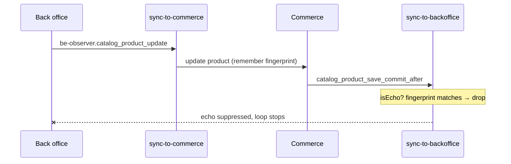

# Circuit Breaker (infinite-loop breaker) sample

A minimal Adobe Commerce app (App Management) that keeps a product in sync
between Commerce and an external **back-office** system **in both directions**,
using an *infinite-loop breaker* so a single change does not echo forever.

## The loop, and how it is broken

Bidirectional sync can echo endlessly:

1. Back office updates a product → the app applies it to Commerce.
2. Saving in Commerce fires `catalog_product_save_commit_after` → the app pushes
   it back to the back office.
3. The back office applies it again → back to step 1.

The breaker fingerprints the payload of each processed event and discards any
event whose fingerprint matches one just handled (within a short TTL). After one
round trip the echo is recognized and dropped, so the loop stops.



## Moving parts

| File | Role |
| ---- | ---- |
| `app.commerce.config.ts` | Declares the Commerce provider + event and the external (back-office) provider + event, each routed to an action. |
| `src/commerce-extensibility-1/lib/circuit-breaker.js` | The reusable, domain-agnostic breaker: wrap a handler with `withCircuitBreaker` (or use the `isEcho` / `remember` primitives), backed by `@adobe/aio-lib-state`. |
| `src/commerce-extensibility-1/product/utils/change.js` | Normalizes the product and builds the shared state key + fingerprint used by both actions. |
| `src/commerce-extensibility-1/product/actions/sync-to-commerce/index.js` | Back office → Commerce. Applies the change via the Commerce client from `@adobe/aio-commerce-lib-app` (`getCommerceClient`). |
| `src/commerce-extensibility-1/product/actions/sync-to-backoffice/index.js` | Commerce → back office. Publishes the back-office event via `@adobe/aio-commerce-lib-app` (`publishEvent`). |

Each action runs the breaker check **before** processing and stores the
fingerprint **after** — the check has to live in every action that participates
in the loop (App Management routes each event to its own action).

## Notes

- The state key is scoped to the product `sku`; the fingerprint covers only the
  fields propagated (`sku`, `name`, `description`, `price`). Volatile fields such
  as `updated_at` are excluded, otherwise every echo looks like a new change.
- The TTL (default 60s) must cover the round trip to the back office and back,
  but stay short enough not to suppress genuine rapid edits.

## Prerequisites

- An App Builder project with the `CloudIntegrationSDK` (I/O Events) and
  `commerceeventing` services subscribed.
- IMS credentials available to the actions as `AIO_COMMERCE_AUTH_IMS_*` inputs
  (already wired in `ext.config.yaml`).

## Build & deploy

```sh
aio app build
aio app deploy
```
