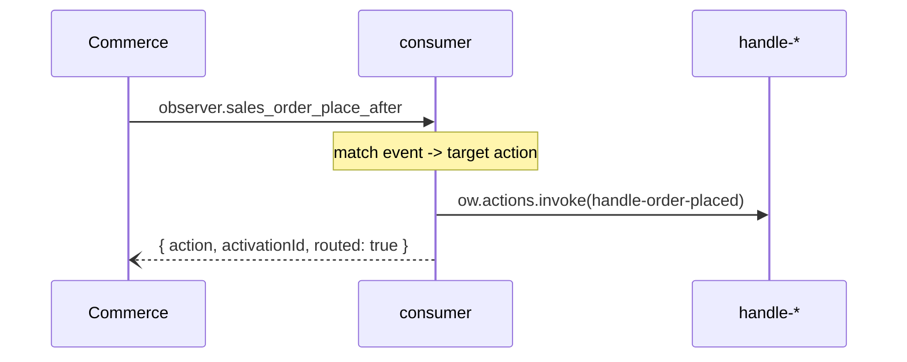

# Multi Event Consumer sample

A minimal Adobe Commerce app (App Management) that shows how several event subscriptions can share a single runtime action, and how that action tells the events apart and dispatches each to its own handler.

## Why route through one action

An App Builder workspace has a limit on the number of registrations — the bindings that tie an event provider + event to a runtime action — it can have. An app with a lot of events can hit that limit if each event gets its own registration. Routing several events to a single `consumer` action collapses them into one registration, so the app can keep consuming many event types without running into the limit; the consumer then dispatches each event to the action that actually handles it.

This sample declares three Commerce events — order placed, customer saved, product saved — that all route to a single `consumer` action. The consumer matches the incoming event against the ones it knows about and forwards it, via an OpenWhisk invoke, to the action that actually handles it.



## Moving parts

| File                                                                  | Role                                                                                                                                                                                                                                                                            |
| --------------------------------------------------------------------- | ------------------------------------------------------------------------------------------------------------------------------------------------------------------------------------------------------------------------------------------------------------------------------- |
| `app.commerce.config.ts`                                              | Declares the three Commerce events, all routed to `multi-event-consumer/consumer`.                                                                                                                                                                                              |
| `src/commerce-extensibility-1/lib/router.js`                          | The reusable, domain-agnostic dispatcher: `withEventRouter(routes)` matches an I/O event code against the incoming CloudEvent `type` and invokes the target action via `openwhisk`. It has no knowledge of how event codes are resolved — callers supply them already resolved. |
| `src/commerce-extensibility-1/actions/consumer/index.js`              | The shared action all three events route to. Resolves each declared event name to its I/O event code (`resolveIoEventCode`) and wraps `withEventRouter` with the resulting code → action routes.                                                                                |
| `src/commerce-extensibility-1/actions/handle-order-placed/index.js`   | Handles the order-placed event forwarded by the consumer.                                                                                                                                                                                                                       |
| `src/commerce-extensibility-1/actions/handle-customer-saved/index.js` | Handles the customer-saved event forwarded by the consumer.                                                                                                                                                                                                                     |
| `src/commerce-extensibility-1/actions/handle-product-saved/index.js`  | Handles the product-saved event forwarded by the consumer.                                                                                                                                                                                                                      |

## How matching works

`resolveIoEventCode` computes the same I/O event code Commerce assigns an event at installation time, from the app id and the event `name` declared in `app.commerce.config`. The consumer action resolves a code for each event it knows about, then hands `{ code, action }` routes to `withEventRouter`, which builds the event-code → action map once and looks up the incoming CloudEvent `type` (`params.type`) on every invocation to find the target action.

## Adding another event to the consumer

1. Declare the event in `app.commerce.config.ts` with `runtimeActions: [CONSUMER_ACTION]`.
2. Add its handler action under `src/commerce-extensibility-1/actions/` and register it in `ext.config.yaml`.
3. In `actions/consumer/index.js`, resolve its event code with `resolveEventCode` and add a `{ code, action }` entry to the `withEventRouter` call.

## Prerequisites

- An App Builder project with the `CloudIntegrationSDK`, `commerceeventing`, and `AdobeIOManagementAPISDK` services subscribed (see `install.yaml`).

## Build & deploy

```sh
aio app build
aio app deploy
```
